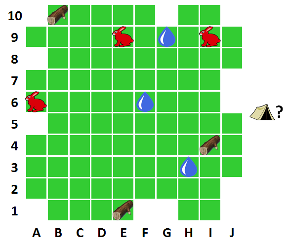

#Shelter in Place

You have found yourself lost in the woods and you don't expect to be found for several months.  You'll need to build a camp so you are in close proximity to water, food, and firewood in order to survive the coming winter.

Fortunately you have a map of the local area's resources (figure 1) which should help you decide where to set up your camp.  The available resources are water (indicated by the blue drop icon), firewood (indicated by the brown log icon), and food (indicated by the red rabbit icon).

Choose any green location to set up your camp site with the goal of minimizing your daily travel distance to resources.  Unfortunately some resources require multiple trips per day to meet your needs.   Water requires three trips per day.  Firewood requires two trips per day, and food requires one trip per day.  You must always return back to camp after visiting any resource location.  Assume resources never run out. 

For example, if you build your camp at location I9, you will have to travel a total of 32 units per day (12 units for water because it is 4 units round trip times 3 trips per day, 20 units for firewood because it is 10 units round trip times 2 trips per day, and 0 units for food because your camp occupies the same location).

   
Question:  At which location should you build your camp?
